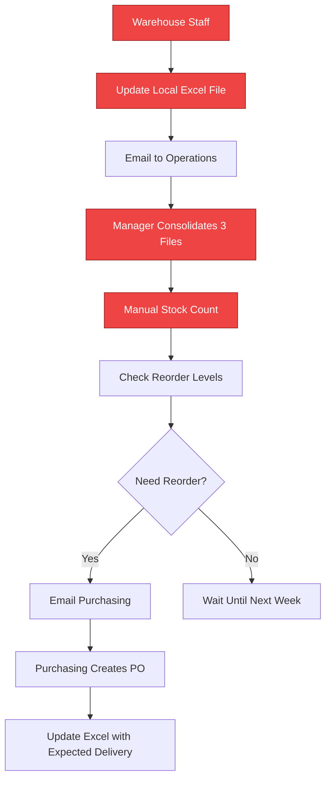
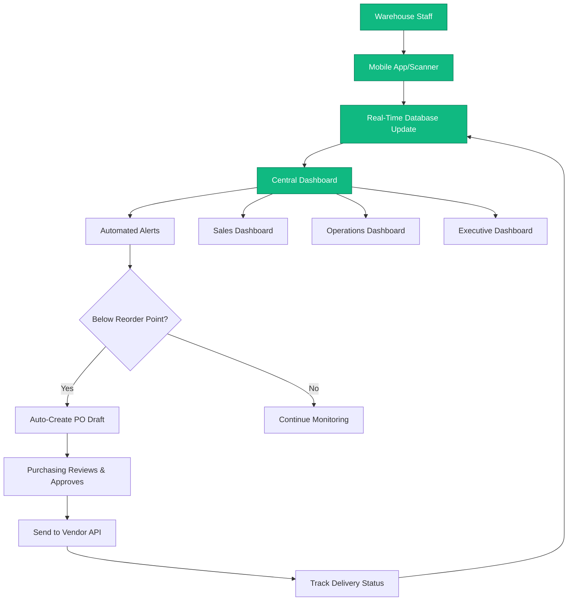
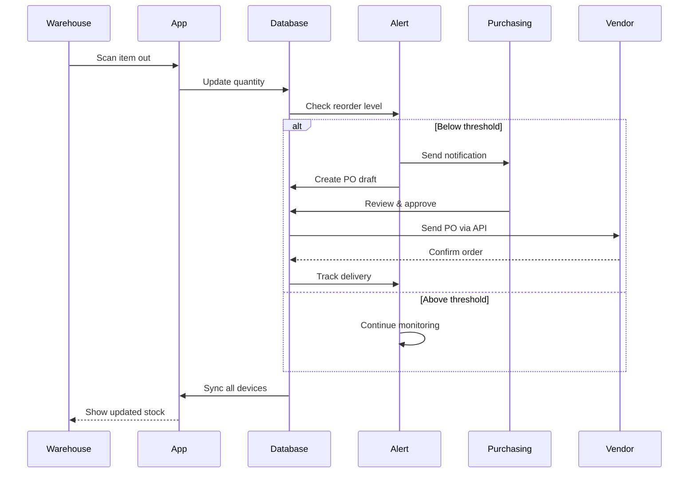

# ABC Manufacturing - Inventory Management Workflow

**Date:** 2025-11-03  
**Prepared for:** Sarah Johnson, Operations Manager  
**Company:** ABC Manufacturing Inc.

---

## Executive Summary

ABC Manufacturing currently manages inventory across three warehouses using multiple Excel spreadsheets shared via email. This creates data inconsistency, delayed updates, and difficulty tracking stock levels in real time. The proposed system centralizes inventory data in a cloud database with real-time dashboards and automated reorder alerts.

---

## Current State Workflow

### Pain Points

1. **Manual Consolidation**
   - Time spent: 5 hours per week
   - Error rate: ~15% (missed updates, typos)
   - Risk: Stock-outs due to delayed visibility

2. **Version Control Chaos**
   - Three warehouse files updated independently
   - Email delays cause stale data
   - No audit trail of who changed what

3. **Reactive Ordering**
   - Stock levels checked weekly
   - 3-4 day lag between need and PO
   - Emergency orders cost 20% more

4. **Limited Visibility**
   - Only operations manager sees full picture
   - Warehouse staff can't see other locations
   - Sales team has no stock visibility

---

## Proposed Automated Workflow

### Key Improvements

1. **Real-Time Updates**
   - Instant sync across all locations
   - Mobile scanning for quick updates
   - No manual consolidation needed

2. **Single Source of Truth**
   - One database, multiple views
   - Complete audit trail
   - Historical trending data

3. **Proactive Ordering**
   - Automatic reorder alerts
   - Smart forecasting based on history
   - Vendor integration for faster ordering

4. **Universal Access**
   - Role-based dashboards
   - Mobile access for warehouse staff
   - Sales team sees availability

---

## Detailed Process Flow

---

## Data Structure

### Current Spreadsheet (Per Warehouse)

| Column | Type | Example | Issues |
|--------|------|---------|--------|
| Part Number | Text | "ABC-123" | Inconsistent format |
| Description | Text | "Widget" | Varies by warehouse |
| Quantity | Number | "45" | Not real-time |
| Location | Text | "Bin A-5" | Different naming |
| Reorder Level | Number | "20" | Often outdated |
| Last Updated | Text | "10/15" | Ambiguous dates |

### Proposed Database Schema

| Field | Type | Validation | Notes |
|-------|------|------------|-------|
| part_number | VARCHAR(20) | Unique, uppercase | Standardized |
| description | VARCHAR(200) | Required | Master data |
| quantity_on_hand | INTEGER | >= 0 | Live count |
| warehouse_id | FK | Foreign key | Normalized |
| bin_location | VARCHAR(20) | Format validated | Consistent |
| reorder_level | INTEGER | > 0 | Per warehouse |
| reorder_quantity | INTEGER | > 0 | Calculated |
| last_movement | TIMESTAMP | Auto | Audit trail |
| updated_by | FK | User ID | Accountability |

---

## Dashboard Preview

### Operations Manager View

**Key Metrics (Live)**
- Total SKUs: 2,847
- Low Stock Items: 23
- Pending Orders: 14
- Stock Value: $487,329

**Alerts**
- 🔴 5 items out of stock
- 🟡 18 items below reorder level
- 🟢 Order #1234 arriving today

**Charts**
- Stock levels by warehouse
- Top 20 items by movement
- Reorder frequency trends

### Warehouse View

**My Location (Warehouse A)**
- Today's movements: 47 items
- Current value: $162,445
- My pending picks: 8 orders

**Quick Actions**
- Scan in/out
- Check item location
- Report discrepancy
- View recent activity

### Sales Dashboard

**Stock Availability**
- Search any part number
- See all warehouse quantities
- Estimated replenishment dates
- Reserve inventory for quotes

---

## Technical Implementation

### Phase 1: Database & Core System
- Design normalized schema
- Set up PostgreSQL database
- Build REST API
- **Timeline:** Week 1-2
- **Cost:** $8,000

### Phase 2: Data Migration
- Clean and standardize part numbers
- Import 2,847 SKUs
- Reconcile quantities across warehouses
- **Timeline:** Week 2-3
- **Cost:** $3,000

### Phase 3: Web Dashboard
- Operations manager view
- Purchasing interface
- Admin panel for master data
- **Timeline:** Week 3-5
- **Cost:** $12,000

### Phase 4: Mobile App
- iOS/Android scanning app
- Barcode integration
- Offline mode
- **Timeline:** Week 5-7
- **Cost:** $15,000

### Phase 5: Vendor Integration
- Email-to-PO automation
- API integration (where available)
- Delivery tracking
- **Timeline:** Week 7-8
- **Cost:** $5,000

### Phase 6: Training & Launch
- Staff training (all 12 users)
- 2-week parallel run
- Full cutover
- **Timeline:** Week 8-10
- **Cost:** $2,000

**Total Development:** $45,000  
**Timeline:** 10 weeks

---

## Cost-Benefit Analysis

### Current State Costs (Annual)
- Manual consolidation: 5 hrs/week × $45/hr × 52 = $11,700
- Error correction: 3 hrs/week × $45/hr × 52 = $7,020
- Emergency orders (20% premium): $18,000
- Stock-outs (lost sales): $25,000 (estimated)
- **Total annual cost:** $61,720

### Proposed Solution Costs
- Development: $45,000 (one-time)
- Hosting: $200/month = $2,400/year
- Support: $300/month = $3,600/year
- **Year 1 total:** $51,000
- **Ongoing annual:** $6,000

### Financial Impact
- **Year 1 savings:** $61,720 - $51,000 = $10,720
- **Year 2+ savings:** $61,720 - $6,000 = $55,720
- **ROI:** 21% in Year 1, 928% thereafter
- **Payback period:** 8.8 months

### Additional Benefits (Not Quantified)
- Better customer service (stock visibility)
- Reduced carrying costs (optimized reorder levels)
- Data for forecasting and planning
- Scalability for growth

---

## Risk Assessment

| Risk | Impact | Likelihood | Mitigation |
|------|--------|------------|------------|
| Data loss during migration | High | Low | Full backups, staged rollout |
| Barcode scanning errors | Medium | Medium | Validation, manual override |
| Internet connectivity issues | High | Low | Offline mode, local cache |
| User adoption resistance | Medium | Medium | Training, gradual rollout |
| Vendor integration delays | Low | Medium | Manual backup process |

---

## Success Metrics

**Month 1 Goals:**
- All 2,847 SKUs migrated
- 100% data accuracy verified
- All 12 users trained

**Month 3 Goals:**
- Zero manual consolidation
- < 2% error rate on stock counts
- 80% reduction in emergency orders

**Month 6 Goals:**
- 50% reduction in stock-out events
- 90% of POs auto-generated
- 5 hours/week time savings realized

---

## Next Steps

1. **Review mockup demonstration** (scheduled for next week)
2. **Approve budget and timeline** 
3. **Identify project champion** from operations team
4. **Schedule kickoff meeting** with IT, operations, purchasing

---

## Appendix

### Interview Notes

**Interview Date:** 2025-10-28  
**Participants:** Sarah Johnson (Operations), Mike Chen (Warehouse A), Lisa Rodriguez (Purchasing)

Key insights:

- "We spend more time managing spreadsheets than managing inventory" - Sarah
- "I never know if what I'm looking at is current" - Mike
- "By the time I see the reorder request, we're already out of stock" - Lisa

### Screen Captures Analyzed

- `warehouse-a-inventory.xlsx` - Last updated 10/25
- `warehouse-b-inventory.xlsx` - Last updated 10/20 (5 days stale!)
- `warehouse-c-inventory.xlsx` - Last updated 10/26
- `consolidated-master.xlsx` - 2,847 rows, inconsistent formats

### Data Quality Findings

- 234 part numbers with inconsistent formatting
- 67 items with different descriptions across warehouses
- 12 items with negative quantities (data errors)
- Average consolidation lag: 3.5 days

