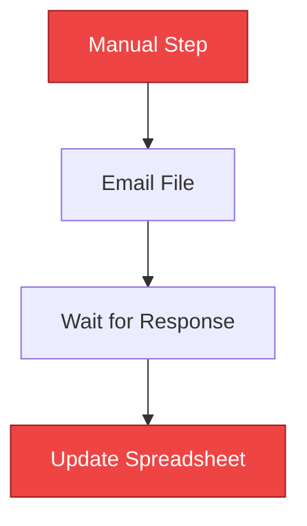
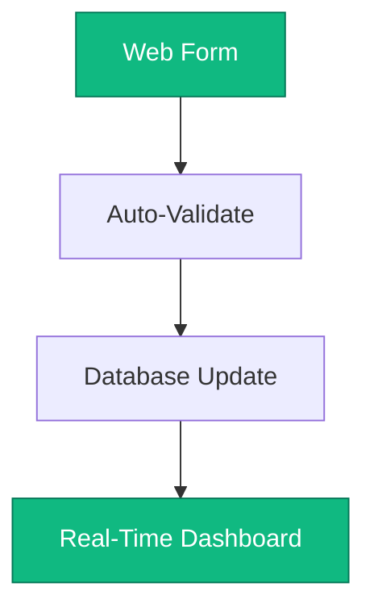
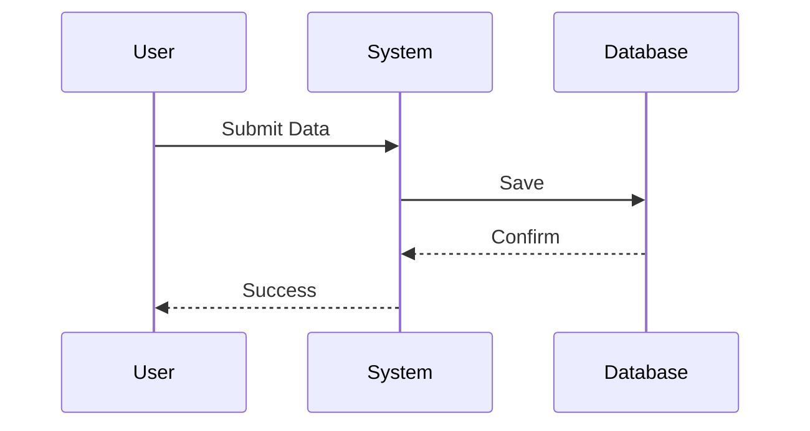

# Workflow Documentation Templates

Templates for documenting client workflows with Mermaid diagrams. These become the foundation for creating interactive mockups.

## Files in This Directory

### TEMPLATE_workflow-name.md
Complete template with all sections. Copy this for each new client project.

**Includes:**
- Executive summary
- Current state workflow (Mermaid diagram)
- Pain points analysis
- Proposed automated workflow (Mermaid diagram)
- Data structure mapping
- Dashboard preview
- Technical implementation plan
- Cost-benefit analysis
- Risk assessment
- Success metrics

### EXAMPLE_manufacturing-inventory.md
Fully completed example for a manufacturing client with inventory management needs.

**Study this to see:**
- How to write specific pain points
- Good Mermaid diagram structure
- Realistic ROI calculations
- Detailed implementation phases
- Industry-specific terminology

## Quick Start

1. **After discovery call with client:**
   ```bash
   cp TEMPLATE_workflow-name.md ../client-name/WORKFLOW.md
   ```

2. **Fill in all sections** with client-specific information

3. **Create Mermaid diagrams** showing current and proposed workflows

4. **Calculate ROI** based on time saved and error reduction

5. **Export as PDF** for client delivery

## Mermaid Diagram Tips

### Current State (Problems in Red)


### Proposed State (Solutions in Green)


### Process Flow (Sequence Diagram)


## Common Workflow Patterns

### Data Entry → Processing → Reporting
Manufacturing, inventory, order processing

### Request → Approval → Tracking
HR, procurement, legal case management

### Schedule → Assign → Complete
Service businesses, field operations

### Collect → Aggregate → Analyze
Financial reporting, sales tracking

## Section-by-Section Guide

### Executive Summary
2-3 sentences covering:
- What they currently do
- Main problem
- Proposed solution

### Current State Workflow
- Map every step they showed you
- Include decision points
- Note manual handoffs
- Add time estimates

### Pain Points
For each issue:
- Specific description
- Quantified impact (hours, dollars, errors)
- Real example or quote from client

### Proposed Workflow
- Show automation replacing manual steps
- Include validation and error handling
- Show real-time updates
- Note notifications and alerts

### Data Structure
- List current spreadsheet columns
- Show proposed database fields
- Explain improvements (validation, types)
- Note relationships between entities

### Dashboard Preview
Describe views for:
- Executives (high-level KPIs)
- Managers (team performance)
- Users (my tasks, recent activity)

### Technical Implementation
Break into phases:
- Phase 1: Database and core features
- Phase 2: Automations
- Phase 3: Integrations
- Each with timeline and cost

### Cost-Benefit Analysis
**Current costs:**
- Manual time × hourly rate
- Error correction time
- Opportunity cost

**Proposed costs:**
- Development (one-time)
- Hosting (monthly)
- Support (monthly)

**Calculate:**
- Annual savings
- ROI percentage
- Payback period

### Risk Assessment
For each risk:
- Impact (High/Medium/Low)
- Likelihood
- Mitigation strategy

### Success Metrics
Set targets for:
- Month 1 (adoption)
- Month 3 (efficiency gains)
- Month 6 (full benefits)

## Writing Tips

### Be Specific
❌ "Takes a long time"
✅ "Takes 4.5 hours per week"

❌ "Causes problems"
✅ "Results in 3-4 data entry errors per day"

### Use Client's Words
If they said "We're always playing catch-up", quote that directly.
Use their terminology for processes, roles, and systems.

### Show Your Work
Don't just say "$50K savings" - show the calculation:
```
10 hours/week × $45/hour × 52 weeks = $23,400
+ Error correction: $8,000
+ Opportunity cost: $18,600
= $50,000 total savings
```

### Be Realistic
Don't promise:
- 100% error elimination
- Unrealistic timelines
- Features you can't deliver
- Savings you can't prove

### Stay Focused
Document what you saw in the discovery call.
Don't design features they didn't ask for.
Keep scope manageable.

## Integration with Mockup Framework

This workflow doc feeds directly into the mockup:

**Workflow Doc → Mockup**
- Current workflow → "Before" list
- Proposed workflow → Interactive steps
- Dashboard views → Dashboard tabs
- ROI calculations → ROI section
- Pain points → Problem descriptions

See `../WORKFLOW_TO_MOCKUP_GUIDE.md` for complete process.

## Examples by Industry

### Manufacturing
Focus on: Real-time tracking, inventory alerts, supplier coordination

### Professional Services
Focus on: Time tracking, client management, automated billing

### Logistics/Operations
Focus on: Scheduling, resource allocation, status updates

### Finance/Accounting
Focus on: Data consolidation, automated reports, compliance

### Healthcare/Medical
Focus on: Patient tracking, appointment management, reporting

## Common Mistakes to Avoid

1. **Too generic** - Using template text without customization
2. **Too complex** - Trying to solve everything at once
3. **Unrealistic ROI** - Inflating savings to make sale
4. **Missing details** - Not enough specifics about current state
5. **No visuals** - Forgetting to create Mermaid diagrams
6. **Wrong terminology** - Not using client's words

## Workflow Doc Checklist

Before sending to client:
- [ ] All `[Placeholder]` text replaced
- [ ] Mermaid diagrams render correctly
- [ ] Client name and contact info correct
- [ ] Pain points match what they described
- [ ] Proposed solution addresses each pain point
- [ ] ROI calculations shown with formulas
- [ ] Timeline is realistic
- [ ] Risks identified with mitigations
- [ ] No typos or grammatical errors
- [ ] Exports cleanly to PDF

## File Naming Convention

```
client-name/
  └── WORKFLOW.md                    # Main document
  └── WORKFLOW_v2.md                 # After revisions
  └── WORKFLOW_FINAL.md              # Approved version
```

## Version Control

Track changes as you refine:
```bash
git add client-name/WORKFLOW.md
git commit -m "Initial workflow doc for [Client Name]"

# After client feedback
git commit -m "Updated based on client feedback: added X, removed Y"
```

## Exporting to PDF

### VS Code (with Markdown PDF extension)
1. Open workflow doc
2. Press Ctrl+Shift+P (Cmd+Shift+P on Mac)
3. Type "Markdown PDF: Export (pdf)"
4. Select PDF

### Pandoc
```bash
pandoc WORKFLOW.md -o WORKFLOW.pdf --pdf-engine=xelatex
```

### Online Tools
- HackMD (hackmd.io)
- Dillinger (dillinger.io)
- Copy to Google Docs and export

## Next Steps

1. Review `EXAMPLE_manufacturing-inventory.md`
2. Complete discovery call with client
3. Copy template for their project
4. Fill in all sections with specifics
5. Create Mermaid diagrams
6. Calculate ROI
7. Export to PDF
8. Move to mockup creation phase

## Support

- Mermaid syntax: https://mermaid.js.org/intro/
- Markdown guide: https://www.markdownguide.org
- Complete process: `../WORKFLOW_TO_MOCKUP_GUIDE.md`

