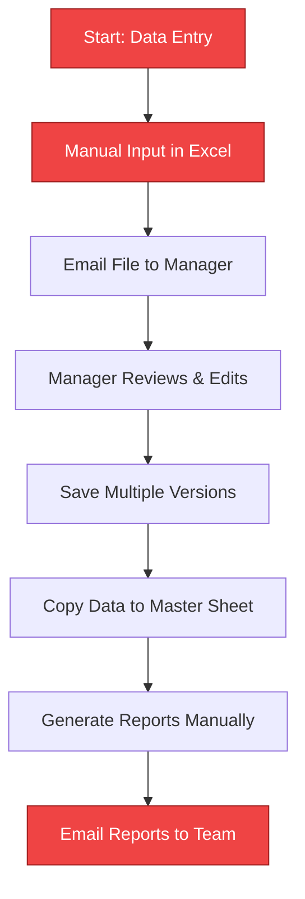
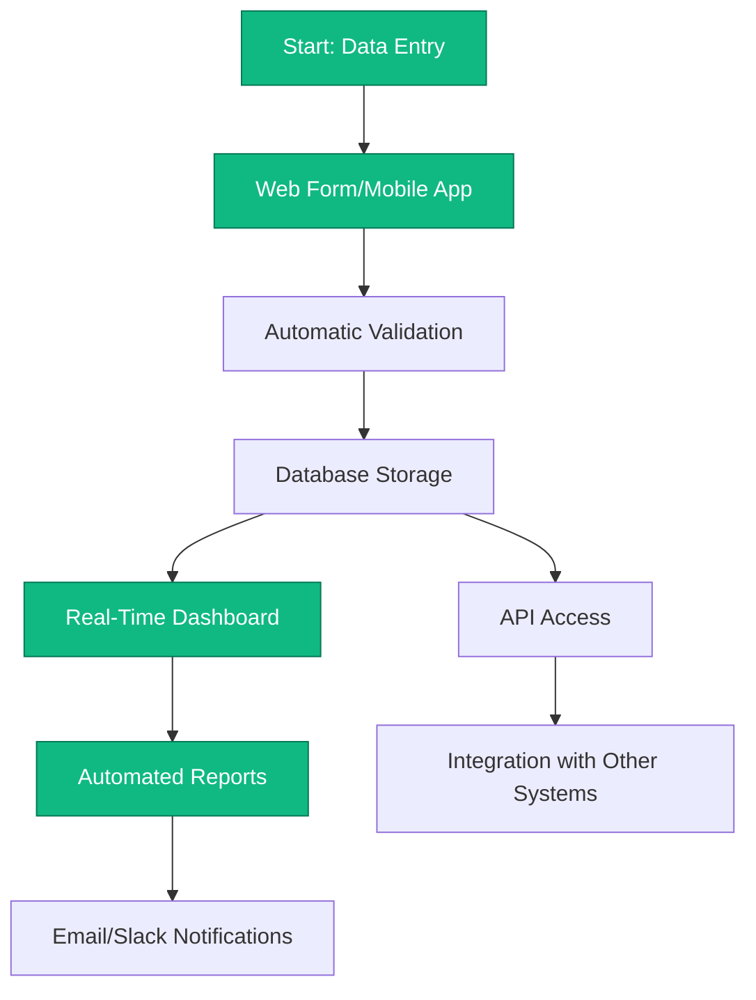
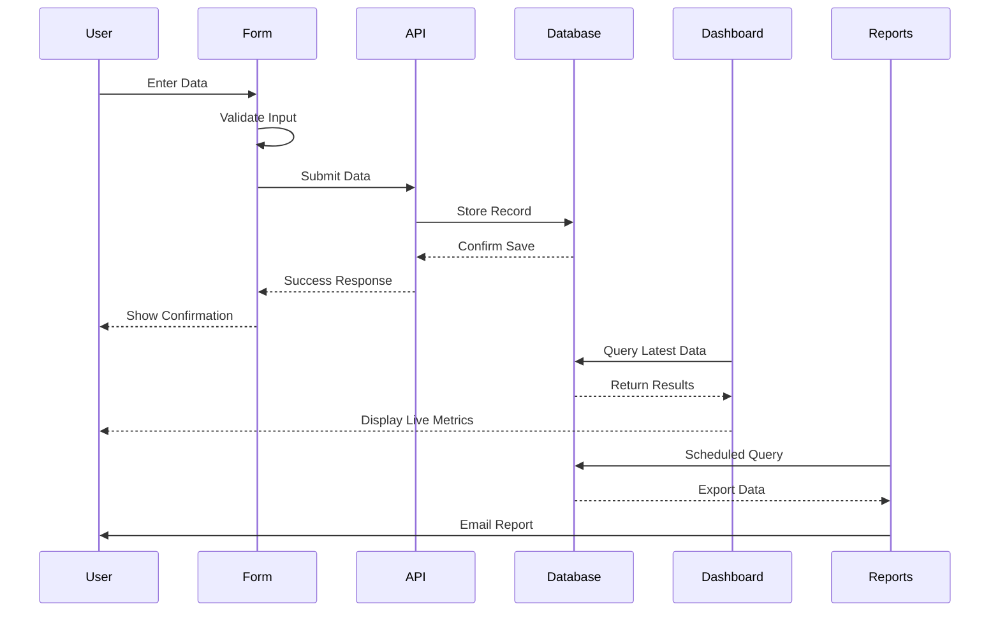

# [Client Name] - [Workflow Name]

**Date:** [YYYY-MM-DD]  
**Prepared for:** [Client Contact Name]  
**Company:** [Company Name]

---

## Executive Summary

Brief overview of the current workflow and proposed automation solution (2-3 sentences).

---

## Current State Workflow

### Pain Points

1. **Manual Data Entry**
   - Time spent: [X hours per week]
   - Error rate: [estimated %]
   - Risk: Data inconsistency across versions

2. **Version Control Issues**
   - Multiple file versions circulating
   - No single source of truth
   - Difficult to track changes

3. **Reporting Delays**
   - Reports generated weekly/monthly
   - Manual compilation from multiple sources
   - Limited real-time visibility

4. **Limited Access**
   - Only [X] people can generate reports
   - Requires Excel expertise
   - No mobile access

---

## Proposed Automated Workflow

### Key Improvements

1. **Automated Data Entry**
   - Web form with validation
   - Mobile app option
   - Auto-save and backup

2. **Single Source of Truth**
   - Centralized database
   - Version history tracked
   - Audit trail for all changes

3. **Real-Time Reporting**
   - Live dashboards
   - Scheduled automated reports
   - Custom views per role

4. **Universal Access**
   - Role-based permissions
   - Web and mobile access
   - Self-service reporting

---

## Detailed Process Flow

---

## Data Structure

### Current Spreadsheet Columns

| Column | Type | Example | Issues |
|--------|------|---------|--------|
| Date | Text | "1/5/2025" | Inconsistent format |
| Customer | Text | "Acme Corp" | Duplicate entries, typos |
| Amount | Number | "$1,234.56" | Mix of formats |
| Status | Text | "Pending" | No validation |
| Notes | Text | Free text | Unstructured |

### Proposed Database Schema

| Field | Type | Validation | Notes |
|-------|------|------------|-------|
| date | DATE | ISO 8601 | Auto-formatted |
| customer_id | FK | Reference table | No duplicates |
| amount | DECIMAL(10,2) | Positive only | Standardized |
| status | ENUM | Predefined list | Dropdown only |
| notes | TEXT | Optional | Searchable |

---

## Dashboard Preview

### Executive View

**Key Metrics (Live)**
- Total Revenue: $XXX,XXX
- Active Customers: XXX
- Pending Items: XX
- Completion Rate: XX%

**Charts**
- Revenue trend (last 30 days)
- Status breakdown (pie chart)
- Top customers (bar chart)
- Activity timeline

### Manager View

**Team Performance**
- Items processed per person
- Average processing time
- Error rate by team member
- Backlog by status

### User View

**My Tasks**
- Assigned items
- Recent submissions
- Quick data entry form
- Personal performance stats

---

## Technical Implementation

### Phase 1: Database Setup
- Design schema
- Set up PostgreSQL/MySQL
- Create backup strategy
- **Timeline:** Week 1-2

### Phase 2: Data Migration
- Clean existing data
- Import to database
- Validate accuracy
- **Timeline:** Week 2-3

### Phase 3: Web Interface
- Build data entry forms
- Create dashboard views
- Implement user authentication
- **Timeline:** Week 3-5

### Phase 4: Reporting
- Automated report generation
- Email notifications
- Export functionality
- **Timeline:** Week 5-6

### Phase 5: Training & Launch
- User training sessions
- Documentation
- Parallel run with spreadsheets
- Full cutover
- **Timeline:** Week 6-8

---

## Cost-Benefit Analysis

### Current State Costs
- Manual data entry: [X hours/week × $Y/hour]
- Error correction: [X hours/week × $Y/hour]
- Report generation: [X hours/week × $Y/hour]
- **Total annual cost:** $XXX,XXX

### Proposed Solution
- Development: $XX,XXX (one-time)
- Hosting: $XXX/month
- Maintenance: $XXX/month
- **Annual cost:** $XX,XXX

### Savings
- Time saved: [X hours/week]
- **Annual savings:** $XXX,XXX
- **ROI:** [X]% in first year
- **Payback period:** [X] months

---

## Risk Assessment

| Risk | Impact | Mitigation |
|------|--------|------------|
| Data loss during migration | High | Full backups, parallel run |
| User adoption resistance | Medium | Training, gradual rollout |
| System downtime | Medium | Cloud hosting, redundancy |
| Integration challenges | Low | API-first design |

---

## Success Metrics

**Month 1 Goals:**
- 100% data migrated accurately
- 80% user adoption rate
- < 5 minutes average data entry time

**Month 3 Goals:**
- 95% user adoption
- Zero data entry errors
- 50% reduction in report generation time

**Month 6 Goals:**
- Full spreadsheet retirement
- 70% time savings
- Positive user feedback (>4/5 rating)

---

## Next Steps

1. **Review this document** and provide feedback
2. **Schedule mockup demonstration** (interactive HTML prototype)
3. **Approve proposal** to begin development
4. **Kickoff meeting** with all stakeholders

---

## Appendix

### Interview Notes

**Interview Date:** [Date]  
**Participants:** [Names]

Key quotes and insights from interviews:

- "[Quote about current pain points]"
- "[Quote about desired features]"
- "[Quote about success criteria]"

### Screen Captures

Reference images from current workflow:
- `screenshot-01-data-entry.png`
- `screenshot-02-report-example.png`
- `screenshot-03-dashboard-concept.png`

### Spreadsheet Analysis

**Files analyzed:**
- `master-data-2024.xlsx` - 2,345 rows, 23 columns
- `monthly-report-template.xlsx` - 12 tabs
- `customer-database.xlsx` - 456 entries

**Key findings:**
- Data spans [X] years
- [X] duplicate entries found
- [X] inconsistent formats identified

